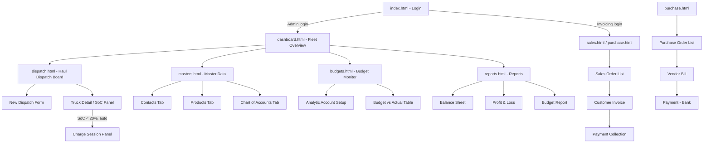

# Page-to-Page Workflow — Mining Haul Dispatch & Charging System

> Companion to `mining-truck-dispatch-system.md`. This file maps every screen, the actions on it, the API calls it triggers, and where the user goes next — for all three actors: **Admin**, **Invoicing User**, **System (automated)**.

---

## 1. Site Map (Navigation Overview)

---

## 2. Actor Landing Pages

| Actor | Lands on after login | Default nav visible |
|---|---|---|
| Admin | `dashboard.html` | Dashboard, Dispatch, Masters, Budgets, Reports |
| Invoicing User | `sales.html` | Sales, Purchase, Reports (read-only) |
| System | no UI — runs via `BatteryMonitorJob` and posts into the same tables the UI reads |

---

## 3. Page-by-Page Workflow

### 3.1 `index.html` — Login
- **Shown to:** everyone, unauthenticated.
- **Elements:** username/password fields, "Login" button, role indicator (none shown pre-auth).
- **Action:** `POST /api/v1/auth/login` → returns JWT + role.
- **On success:** store JWT in `localStorage`; redirect by role (Admin → `dashboard.html`, Invoicing → `sales.html`).
- **On failure:** inline error, stay on page.

---

### 3.2 `dashboard.html` — Fleet Overview (Admin home)
- **Loads:** `GET /api/v1/haul/trucks`, `GET /api/v1/haul/chargers`, `GET /api/v1/haul/charge-sessions?active=true`
- **Shows:**
  - Truck cards/table: code, status badge, SoC gauge, current route.
  - Charger status grid: AVAILABLE / OCCUPIED / OFFLINE.
  - Alert banner for any truck with SoC < 20% currently `EN_ROUTE_TO_CHARGE` (auto-triggered by System).
- **Actions → navigation:**
  - Click a truck row → opens **Truck Detail panel** (modal or `dispatch.html?truckId=`) showing haul history + charge history.
  - "New Truck" button → modal form → `POST /api/v1/haul/trucks` → refreshes list.
  - "New Charger" button → modal form → `POST /api/v1/haul/chargers` → refreshes grid.
  - Nav bar → Dispatch, Masters, Budgets, Reports.

---

### 3.3 `dispatch.html` — Haul Dispatch Board
- **Loads:** `GET /api/v1/haul/dispatches?status=IN_PROGRESS`, `GET /api/v1/haul/trucks`, route list.
- **Shows:** table of active/completed dispatches (truck, route, tonnage, status), "Log New Dispatch" button.
- **New Dispatch flow:**
  1. Admin clicks **Log New Dispatch**.
  2. Form: select truck, select route (origin pit → destination dump), tonnage, start time.
  3. Submit → `POST /api/v1/haul/dispatches`.
  4. Backend sets truck status `HAULING`; if that truck's current SoC is already < 20%, the same call synchronously triggers the dispatch service to divert it — response includes `status: DIVERTED_TO_CHARGE` and a `chargeSessionId`.
  5. UI shows a toast: either "Dispatch started" or "Dispatch diverted — truck routed to Charger #X".
- **Ongoing monitoring:** page polls (or WebSocket, optional) every 30–60s for SoC updates; when the **System** job (`BatteryMonitorJob`) auto-diverts a truck mid-haul, the row updates live to `EN_ROUTE_TO_CHARGE`, a **Charge Session Panel** appears inline showing `startSoC`, assigned station, and a live timer.
- **Completion:** Admin (or auto on arrival) marks dispatch `COMPLETED` with final tonnage/time → `PUT /api/v1/haul/dispatches/{id}` → tonnage rolls up into the customer's period total (used later by Sales flow).
- **Navigation:** back to Dashboard; forward to Truck Detail; link out to Reports (Budget Report, filtered by the dispatch's `analyticAccountId`).

---

### 3.4 `masters.html` — Master Data (tabs)
Single page, three tabs, each independent CRUD.

**Tab: Contacts**
- `GET/POST/PUT/DELETE /api/v1/contacts`
- Form: type (Customer/Vendor), name, contact person, email, phone, address, tax ID.
- Used later by Sales Order (Customer) and Purchase Order (Vendor) dropdowns.

**Tab: Products**
- `GET/POST/PUT/DELETE /api/v1/products`
- Form: name, type (Service/Goods), SKU, UoM (Ton-km / Session / Unit), unit price, linked GL account.
- Seeds: *Heavy Ore Haulage Ton-km*, *Megawatt Pantograph Charge Session*, *Haul Truck Drive Motor*.

**Tab: Chart of Accounts**
- `GET/POST/PUT/DELETE /api/v1/accounts`
- Form: code, name, type (Asset/Liability/Income/Expense), parent account.
- Read-only reference for all downstream journal postings — edits here affect how Reports classify amounts.

- **Navigation:** no forward flow of its own; it's the data other pages consume via dropdowns (Contacts → Sales/Purchase; Products → Sales/Purchase line items; Accounts → Budgets/Reports).

---

### 3.5 `purchase.html` — Purchase-to-Pay
- **Loads:** `GET /api/v1/purchase-orders`
- **Step 1 — Create PO:**
  - "New PO" → select vendor (from Contacts), select product (e.g., *Haul Truck Drive Motor*), qty, unit price.
  - `POST /api/v1/purchase-orders` → status `DRAFT`.
  - "Confirm" button → status `CONFIRMED`.
- **Step 2 — Convert to Vendor Bill:**
  - On a confirmed PO, click **Convert to Bill** → `POST /api/v1/purchase-orders/{id}/convert-to-bill`.
  - Creates `VendorBill` (status `OPEN`), posts journal entry (debit *Heavy Tire & Motor Replacement Expenses*, credit *Vehicle Supplier Payables*).
  - UI navigates to the **Vendor Bills** sub-list, new bill highlighted.
- **Step 3 — Pay the Bill:**
  - Click **Pay via Bank** on the bill row → modal (amount, date, bank journal) → `POST /api/v1/vendor-bills/{id}/pay`.
  - Posts journal entry (debit *Vehicle Supplier Payables*, credit *Cash/Bank*); bill status → `PAID`.
- **Navigation:** links to Masters (if vendor/product missing, prompts "Add new" which opens `masters.html` in a new tab/modal); links to Reports → Balance Sheet (to see Payables drop) and P&L (expense line).

---

### 3.6 `sales.html` — Order-to-Cash
- **Loads:** `GET /api/v1/sales-orders`
- **Step 1 — Create Sales Order:**
  - "New SO" → select customer (mining concession), select product (*Heavy Ore Haulage Ton-km*), period (month), estimated qty/rate.
  - `POST /api/v1/sales-orders`.
- **Step 2 — Convert to Customer Invoice:**
  - At period end (or on demand), click **Convert to Invoice** → pulls actual tonnage from completed `HaulDispatch` records for that customer/period.
  - `POST /api/v1/sales-orders/{id}/convert-to-invoice` → creates `CustomerInvoice` with `tonnageBilled` and `amount`; posts journal entry (debit Accounts Receivable, credit *Haulage Transport Revenue*).
  - UI navigates to **Customer Invoices** sub-list.
- **Step 3 — Collect Payment:**
  - Click **Collect Payment** on an invoice → modal (amount, date, bank) → `POST /api/v1/customer-invoices/{id}/collect-payment`.
  - Posts journal entry (debit *Cash/Bank*, credit Accounts Receivable); invoice status → `PAID`.
- **Navigation:** links to Dispatch board (to verify tonnage backing an invoice), links to Reports → P&L (revenue) and Balance Sheet (cash increase).

---

### 3.7 `budgets.html` — Budget Monitor
- **Loads:** `GET /api/v1/analytic-accounts`, `GET /api/v1/budgets`
- **Step 1 — Define Analytic Account:**
  - "New Analytic Account" (e.g., *Open Pit Transport Zone 1*) → `POST /api/v1/analytic-accounts`.
  - Assign this analytic account to Haul Routes (in `dispatch.html` route setup) so dispatch-driven journal lines tag correctly.
- **Step 2 — Set Budget:**
  - "New Budget Line" → select analytic account, select GL account (e.g., *Fleet Charging Power Costs*), period, planned amount.
  - `POST /api/v1/budgets`.
- **Step 3 — Monitor Variance:**
  - Table auto-loads `GET /api/v1/budgets/{id}/variance` per line: planned vs actual (actual = summed journal lines for that analytic+GL account/period), variance %, color-coded (green under budget, red over).
- **Navigation:** "View full report" → `reports.html` (Budget Report, pre-filtered to the selected analytic account/period).

---

### 3.8 `reports.html` — Reports
Three sub-tabs, each independently loaded:

**Balance Sheet**
- `GET /api/v1/reports/balance-sheet?asOf=YYYY-MM-DD`
- Shows Assets (Fleet, Chargers, Cash/Bank) vs Liabilities (Payables, Utility Creditors) as of a date; date picker re-triggers the call.

**Profit & Loss**
- `GET /api/v1/reports/profit-and-loss?from=&to=`
- Shows Haulage Transport Revenue minus Fleet Charging Power Costs and Tire/Motor Replacement Expenses for a period; date-range picker.

**Budget Report**
- `GET /api/v1/reports/budget?analyticAccountId=&period=`
- Table/chart of planned vs actual per analytic account; drill-down link back to `budgets.html` for that line.

- **Navigation:** this is a terminal page — export/print buttons only (e.g., "Export CSV" client-side from the JSON already loaded); no forward flow.

---

## 4. End-to-End Journey Walkthroughs

### Journey A — Fleet Setup (Admin, one-time)
`masters.html` (Chart of Accounts, Contacts, Products) → `dashboard.html` (add Trucks, add Chargers) → `budgets.html` (Analytic Accounts + initial Budgets) → ready to operate.

### Journey B — Daily Haul Cycle (Admin + System)
`dispatch.html` (Log New Dispatch) → System's `BatteryMonitorJob` watches SoC in the background → if SoC < 20%, auto-creates `ChargeSession`, truck flips to `EN_ROUTE_TO_CHARGE` (visible live on `dispatch.html` and `dashboard.html`) → charge completes, journal entry posted automatically → truck returns to `HAULING` or `IDLE` → Admin marks dispatch `COMPLETED`.

### Journey C — Monthly Billing (Invoicing User)
`sales.html` (review Sales Order for the concession) → **Convert to Invoice** (pulls tonnage from completed dispatches) → `customer-invoices` list → **Collect Payment** → confirm on `reports.html` (P&L revenue line, Balance Sheet cash line) that the numbers landed.

### Journey D — Replacing Tires/Motors (Invoicing User)
`purchase.html` (New PO to vendor) → Confirm PO → **Convert to Vendor Bill** → **Pay via Bank** → confirm on `reports.html` (P&L expense line, Balance Sheet payables drop).

### Journey E — Budget Review (Admin, periodic)
`budgets.html` (check variance table, spot an over-budget analytic account) → drill into `reports.html` Budget Report → cross-check `dispatch.html` for which routes/trucks are driving the charging-cost overrun.

---

## 5. Role-Based Page Access Matrix

| Page | Admin | Invoicing User | System |
|---|---|---|---|
| dashboard.html | Full | Read-only | — |
| dispatch.html | Full | Read-only | writes via API (no UI) |
| masters.html | Full | Read (Contacts/Products only, for dropdowns) | — |
| purchase.html | Read | Full | — |
| sales.html | Read | Full | — |
| budgets.html | Full | Read-only | writes actuals via journal postings |
| reports.html | Full | Full | — |
